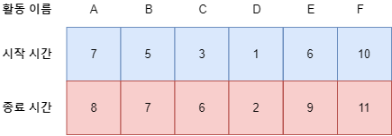
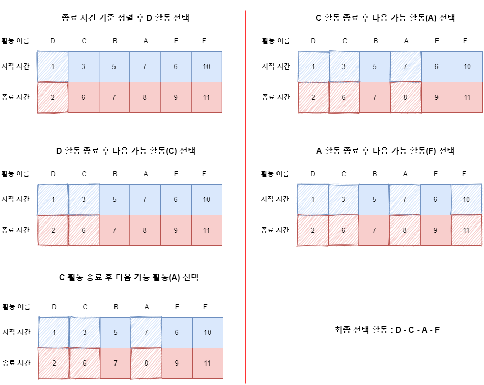

## Action Selection 문제  

그리디 알고리즘의 가장 대표적인 예시인 활동 선택(Action Selection) 문제에 대해서 알아보자.  
활동 선택 문제는 N개의 활동이 있고 각 활동에는 시작 시간 및 종료 시간이 있을 때, 한 사람이 최대한 많이 할 수 있는 활동(Activity)의 수를 구하는 문제이다.  
즉, 각각의 활동(Activity)에는 시간이 소요되므로 하나를 선택했다면 그 동안 해당 시간에 다른 Activity를 할 수 없다. 이러한 상황일 때 가장 많은 활동에 참여하려면 어떻게 해야 할까?  

아래의 그림을 보자.  

  

위에서 각 활동과 그것들의 시작 / 종료 시간이 설정되어 있는 것을 알 수 있다. 이 문제는 최대한 많은 활동을 해야 하므로 언제 시작하든 전체에서 가장 종료 시간이 빠른 것부터 선택해야 한다.  
어차피 시작 시간은 종료 시간 이전이므로 고려하지 않는다.  
따라서, 종료 시간을 기준으로 정렬한 뒤, 제일 먼저 끝나는 활동을 무조건 선택하고 끝났을 때, 바로 다음에 선택할 수 있는 활동을 찾아 수행하는 방식을 반복하여 해결할 수 있다.  

아래의 그림을 통해 해결 방법을 알아보자.  
  

좌측 부터 수행 후 우측 그림과 같이 수행이 완료되어 최종 D - C - A - F 번째 활동을 선택하게 된다.